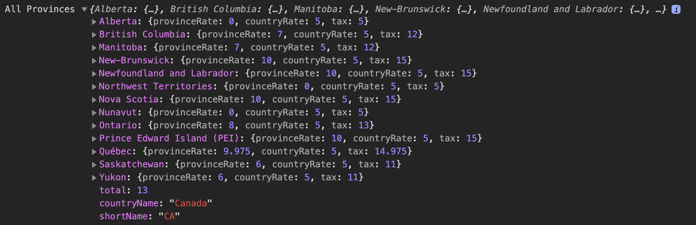

# International fees

## Installation

```shell
$ yarn add international-fees
# or
$ npm install international-fees
```

## Usage


```js
import fees from 'international-fees'

// List all provinces
 console.log(fees.ca)
```
<p align="center">
  
</p>

```js
// List all states
 console.log(fees.usa)
```
<p align="center">
  
</p>

```js
fees.ca['Ontario'].provinceRate // 8
fees.ca['Ontario'].countryRate // 5
fees.ca['Ontario'].tax // 13

fees.usa['New York'].tax // 10
fees.usa['New Jersey'].tax // 1
```

## Contributing

### 01. Learn more in the Contributing guide

Please take a look at the [contributing guide](.github/contributing.md).

### 02. Fork this project

### 03. Install dependencies

```sh
$ yarn or npm install
```

## Respect earns Respect 👏

Please respect our [Code of Conduct](.github/code-of-conduct.md), in short:

- Using welcoming and inclusive language
- Being respectful of differing viewpoints and experiences
- Gracefully accepting constructive criticism
- Focusing on what is best for the community
- Showing empathy towards other community members

## License

[MIT](license) © 2020 Marcus Silva
